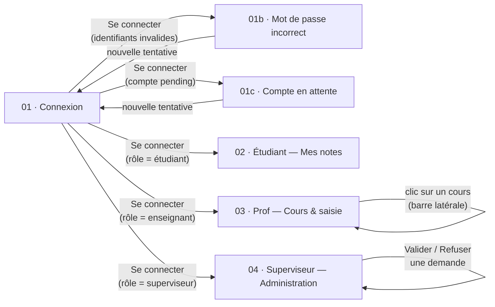

# Documentation Figma — Consultation Notes

> Document de référence à destination de toute personne (développeur, designer, encadrant) devant reprendre en main le fichier Figma du projet **Consultation Notes**, sans connaissance préalable de son organisation.
>
> Fichier Figma : [Consultation Notes](https://www.figma.com/design/HpcKWaPxZcN2NG3E3efafw/Consultation-Notes)
> Ce document complète — sans le remplacer — [`DOCUMENTATION_TECHNIQUE.md`](DOCUMENTATION_TECHNIQUE.md), qui couvre le code (API + frontend). Ici, on couvre uniquement la maquette / le prototype Figma.

---

## Sommaire

1. [Vue d'ensemble du fichier Figma](#1-vue-densemble-du-fichier-figma)
2. [La « page 0 » : la frame `Doc — Analyse & cadrage`](#2-la-page-0--la-frame-doc--analyse--cadrage)
3. [Arborescence des écrans (frames) et sous-écrans](#3-arborescence-des-écrans-frames-et-sous-écrans)
4. [Navigation par clic : comment le prototype s'enchaîne](#4-navigation-par-clic--comment-le-prototype-senchaîne)
5. [Structure en composants : ce qui se répète d'écran en écran](#5-structure-en-composants--ce-qui-se-répète-décran-en-écran)
6. [Correspondance Figma ⇄ code frontend](#6-correspondance-figma--code-frontend)
7. [Écarts entre le cadrage (page 0) et les écrans réellement maquettés](#7-écarts-entre-le-cadrage-page-0-et-les-écrans-réellement-maquettés)
8. [Guide pratique : reprendre et faire évoluer le fichier](#8-guide-pratique--reprendre-et-faire-évoluer-le-fichier)
9. [Axes d'amélioration recommandés](#9-axes-damélioration-recommandés)

---

## 1. Vue d'ensemble du fichier Figma

Le fichier ne contient **qu'une seule page Figma** (un seul « canvas », au sens Figma du terme) : **`Analyse & cadrage`** (id `0:1`). C'est elle que l'URL `?node-id=0-1` du fichier pointe par défaut.

Sur cette unique page cohabitent, côte à côte sur le canevas infini :

| Type de contenu | Rôle |
|---|---|
| Une frame de **documentation** (`Doc — Analyse & cadrage`) | Le cadrage fonctionnel du projet, rédigé *dans Figma même*. C'est la **« page 0 »** évoquée plus bas. |
| Six **frames d'écran** (`01`, `01b`, `01c`, `02`, `03`, `04`) | Les maquettes haute-fidélité, organisées en **prototype cliquable** de bout en bout. |

Point important pour s'orienter : la frame de documentation est positionnée **à gauche de tout le reste** sur le canevas (coordonnée `x = -511`, alors que l'écran `01 · Connexion` commence à `x = 600`). Elle se lit donc **en premier** si l'on parcourt le canevas de gauche à droite — d'où l'appellation « page 0 » : ce n'est pas une page Figma au sens technique, mais la **frame d'introduction** qui précède logiquement les frames numérotées `01` à `04`.

```
Doc — Analyse & cadrage        01 · Connexion        02 · Étudiant        03 · Prof        04 · Superviseur
   (x = -511)                    (x = 600)             (x = 1960)          (x = 3320)         (x = 4680)
        │                            │                      │                   │                  │
        └── se lit en premier ───────┴──────────────────────┴───────────────────┴──────────────────┘
                                          parcours du prototype cliquable
```

---

## 2. La « page 0 » : la frame `Doc — Analyse & cadrage`

**Node Figma** : `89:2` — [ouvrir dans Figma](https://www.figma.com/design/HpcKWaPxZcN2NG3E3efafw/Consultation-Notes?node-id=89-2)

Cette frame (920 × 1959 px) est un **document texte mis en page directement dans Figma**, au même titre qu'une frame de maquette. Elle sert de mémo de cadrage fonctionnel pour le projet DEV1 et se lit comme une mini-spec. Elle est composée de 7 blocs, dans cet ordre :

### 2.1. Objectif & architecture
Rappelle que l'application est un **système 3-tiers** (présentation / métier / données) et pose la règle d'or : *le client ne parle jamais directement à la base de données*, tout transite par la couche métier. Trois blocs résument chaque tier :
- **Présentation** : écrans, saisie, affichage (HTTP / JSON).
- **Métier** : authentification, recherche et restitution des notes.
- **Données** : schéma relationnel, intégrité, requêtes SQL.

> Ce découpage est exactement celui détaillé côté code dans [`DOCUMENTATION_TECHNIQUE.md` §2](DOCUMENTATION_TECHNIQUE.md#2-architecture-globale-du-système) — la maquette et l'implémentation partagent la même architecture.

### 2.2. Acteurs & rôles
Décrit les trois rôles utilisateurs et leurs actions :
- **Étudiant** : se connecter, consulter ses propres notes, voir sa moyenne par cours.
- **Enseignant** : consulter la liste de ses cours, voir les étudiants inscrits, **+ modifier les notes** (mentionné explicitement comme un *ajout hors cahier des charges*).
- **Superviseur** : valider les demandes de compte ; un compte non validé ne peut pas se connecter.

### 2.3. Périmètre
Une colonne « Dans le périmètre » face à une colonne « Hors périmètre (CDC) » :
- **Dans le périmètre** : connexion, inscription (demande de compte), consultation des notes (étudiant), consultation cours + étudiants inscrits (enseignant), validation des comptes (superviseur).
- **Hors périmètre** : saisie/modification des notes par l'enseignant (note : marquée d'un astérisque, *« ajoutée sur demande — à signaler en soutenance comme extension hors-CDC »*), gestion des inscriptions aux cours, modification du profil.

### 2.4. Les 8 échanges (connexion → affichage des notes)
Le scénario nominal, séquencé en 8 étapes, qui correspond point pour point au diagramme de séquence HTTP documenté dans [`DOCUMENTATION_TECHNIQUE.md` §2](DOCUMENTATION_TECHNIQUE.md#2-architecture-globale-du-système) :

1. Login / mot de passe (client → métier)
2. Recherche du compte (métier → données)
3. Profil et rôle (données → métier)
4. Session ouverte + rôle (métier → client)
5. Sélection — étudiant : rien ; enseignant : un cours
6. Requête sur les notes (métier → données)
7. Notes (données → métier)
8. Notes affichées (métier → client)

### 2.5. Routes API suggérées
Un tableau route ↔ rôle requis, qui a directement inspiré le référentiel d'API réel (§7 de la doc technique) :

| Route | Rôle requis |
|---|---|
| `POST /api/connexion` | aucun |
| `POST /api/inscription` | aucun |
| `GET /api/mes-notes` | étudiant |
| `GET /api/mes-cours` | enseignant |
| `GET /api/cours/{id}/notes` | enseignant propriétaire |
| `GET` · `POST /api/comptes-en-attente` | superviseur |

### 2.6. Cas d'erreur & états vides
Liste les cas limites à prévoir : identifiant inconnu, mot de passe erroné, compte en attente de validation, enseignant sans cours, étudiant sans note, cours sans étudiant.

### 2.7. Écrans maquettés (pages Figma)
La frame se termine par sa propre table des matières des écrans à réaliser :
- **Authentification** : Connexion, erreurs (mdp / identifiant), compte en attente, Inscription.
- **Étudiant** : Mes notes, état « aucune note ».
- **Enseignant** : Mes cours (consultation), Modifier les notes, états vides.
- **Superviseur** : Administration (validation des comptes).
- **Prototype** : parcours cliquable de bout en bout.

> ⚠️ Cette liste est **prescriptive** (ce qui était prévu), pas descriptive de l'état actuel. Voir [§7 — Écarts](#7-écarts-entre-le-cadrage-page-0-et-les-écrans-réellement-maquettés) pour la comparaison avec ce qui est réellement maquetté aujourd'hui.

---

## 3. Arborescence des écrans (frames) et sous-écrans

Chaque écran est une frame de 1280 × 832 px (résolution desktop), nommée selon la convention **`NN[lettre] · Rôle — Titre`** : le numéro à deux chiffres indique l'ordre dans le parcours, une lettre (`b`, `c`, …) indique une **variante** du même écran (état d'erreur, état alternatif).

| # | Frame | Node ID | Lien Figma | Rôle concerné | Description |
|---|---|---|---|---|---|
| 01 | `01 · Connexion` | `12:2` | [ouvrir](https://www.figma.com/design/HpcKWaPxZcN2NG3E3efafw/Consultation-Notes?node-id=12-2) | Visiteur | Écran de connexion nominal : email, mot de passe, bouton *Se connecter*, lien *Créer un compte*. |
| 01b | `01b · Connexion — mot de passe incorrect` | `25:27` | [ouvrir](https://www.figma.com/design/HpcKWaPxZcN2NG3E3efafw/Consultation-Notes?node-id=25-27) | Visiteur | Variante du 01 : ajoute une bannière d'erreur *« E-mail ou mot de passe incorrect »* au-dessus des champs. |
| 01c | `01c · Connexion — compte en attente` | `25:52` | [ouvrir](https://www.figma.com/design/HpcKWaPxZcN2NG3E3efafw/Consultation-Notes?node-id=25-52) | Visiteur | Variante du 01 : bannière d'information *« Votre compte est en attente de validation par un superviseur »*, bouton désactivé *« En attente de validation »*. |
| 02 | `02 · Étudiant — Mes notes` | `14:2` | [ouvrir](https://www.figma.com/design/HpcKWaPxZcN2NG3E3efafw/Consultation-Notes?node-id=14-2) | Étudiant | Tableau de bord : 3 cartes statistiques (moyenne générale, cours suivis, meilleure moyenne) + liste détaillée par cours (notes sous forme de puces + moyenne). |
| 03 | `03 · Prof — Cours & saisie des notes` | `17:2` | [ouvrir](https://www.figma.com/design/HpcKWaPxZcN2NG3E3efafw/Consultation-Notes?node-id=17-2) | Enseignant | Vue à deux colonnes : liste des cours en barre latérale (`sidebar`) + panneau de droite avec tableau élève par élève (moyenne, nouvelle note à saisir, heures de colle). |
| 04 | `04 · Superviseur — Administration` | `21:2` | [ouvrir](https://www.figma.com/design/HpcKWaPxZcN2NG3E3efafw/Consultation-Notes?node-id=21-2) | Superviseur | Tableau de bord : 4 cartes statistiques (en attente, étudiants, enseignants, cours actifs) + liste des demandes de création de compte avec actions *Valider* / *Refuser*. |
| — | `Doc — Analyse & cadrage` | `89:2` | [ouvrir](https://www.figma.com/design/HpcKWaPxZcN2NG3E3efafw/Consultation-Notes?node-id=89-2) | — | La « page 0 », voir [§2](#2-la-page-0--la-frame-doc--analyse--cadrage). |

Les frames `01`, `01b` et `01c` sont empilées verticalement les unes sous les autres (même `x`, `y` croissant) : c'est la convention Figma pour regrouper visuellement les **variantes d'un même écran**, tandis que les écrans `01 → 02 → 03 → 04` sont alignés horizontalement pour représenter la **progression du parcours** dans le temps.

---

## 4. Navigation par clic : comment le prototype s'enchaîne

Le bloc 2.7 du cadrage annonce explicitement un **« Prototype : parcours cliquable de bout en bout »**. Concrètement, dans Figma, ce prototype se pilote depuis l'onglet **Prototype** (panneau de droite) : chaque flèche reliant deux frames correspond à une interaction (`On click` → `Navigate to`) posée sur un élément cliquable de la maquette (bouton, lien, ligne de tableau…).

> Pour vérifier ou modifier ces liaisons : ouvrir le fichier Figma, sélectionner l'élément cliquable, passer sur l'onglet **Prototype** dans le panneau de droite — les flèches bleues visibles sur le canevas en mode *Design* matérialisent chaque connexion.

D'après la structure des écrans et le scénario des 8 échanges (§2.4), le parcours cliquable attendu est le suivant :



Points clés à retenir sur cette logique de clic, écran par écran :

- **`01 · Connexion`** : le bouton *Se connecter* est le seul point d'entrée du prototype ; c'est lui qui, selon le rôle simulé, doit rediriger vers `02`, `03` ou `04`. Le lien texte *Créer un compte* est prévu pour pointer vers un écran d'inscription (non maquetté à ce jour — voir §7).
- **`01b` / `01c`** : ce sont des **culs-de-sac visuels** volontaires (pour illustrer un état d'erreur), avec un retour possible vers `01` en modifiant les champs et en recliquant sur le bouton.
- **`03 · Prof`** : la barre latérale (`sidebar`) liste 4 cours, mais un seul (`Mathématiques`) est maquetté avec son panneau de droite rempli. Cliquer sur un autre item de la liste est **censé** changer le panneau de droite (changement de contexte, pas de changement de frame) — dans l'état actuel du fichier, seule la sélection de `Mathématiques` a un panneau associé.
- **`04 · Superviseur`** : les boutons *Valider* / *Refuser* de chaque ligne de demande sont conceptuellement des actions qui feraient disparaître la ligne (et décrémenteraient le compteur *« 3 en attente »*), mais une seule frame illustre l'état « 3 demandes en attente » — il n'y a pas de frame illustrant l'état après validation/refus.

---

## 5. Structure en composants : ce qui se répète d'écran en écran

Le fichier n'utilise pas (à ce stade) de vrais **composants Figma** (`Component` / `Instance`) réutilisables — chaque frame est construite avec des groupes de frames simples, nommés de façon cohérente. Mais visuellement, plusieurs blocs se répètent à l'identique d'un écran à l'autre ; les repérer permet de comprendre rapidement n'importe quel nouvel écran du fichier.

### 5.1. `topbar` — barre supérieure applicative
Présente sur `02`, `03`, `04` (absente de `01`, qui n'est pas encore authentifié). Toujours structurée en deux blocs :
- `brand` (gauche) : logo carré avec initiales *« CN »* + libellé *« Consultation Notes »*.
- `user` (droite) : bloc `uinfo` (nom complet + rôle, ex. *« Léa Martin / Étudiante · L3 »*) accolé à un avatar rond avec les initiales de l'utilisateur.

### 5.2. `Login Card` — carte de connexion
Utilisée par `01`, `01b`, `01c`. Toujours structurée en :
- `header` : logo + titre + sous-titre *« Connectez-vous à votre espace »*.
- *(optionnel)* `banner` : bloc d'alerte avec icône `!` — présent uniquement dans les variantes `01b` (erreur) et `01c` (information).
- Champ `Adresse e-mail` : libellé + `input` (placeholder `prenom.nom@ecole.fr`).
- Champ `Mot de passe` : libellé + `input` (placeholder masqué `••••••••`).
- `button` : bouton principal plein — texte *« Se connecter »* (`01`/`01b`) ou *« En attente de validation »*, visuellement désactivé (`01c`).
- `foot` : texte *« Pas encore de compte ? »* + lien *« Créer un compte »*.

### 5.3. `stat` — carte statistique
Utilisée en haut des tableaux de bord `02` (3 cartes) et `04` (4 cartes). Toujours : un libellé court, une valeur chiffrée en gros, puis une ligne secondaire (delta de comparaison ou précision contextuelle).

### 5.4. `course` — ligne de cours (vue étudiant, écran `02`)
Un bloc `left` (nom du cours + enseignant et nombre de notes) et un bloc `right` contenant une liste de `chip` (une pastille par note obtenue) suivie d'un bloc `avg` (moyenne du cours en évidence).

### 5.5. `nav` — item de barre latérale (vue prof, écran `03`)
Un item par cours enseigné : nom du cours + niveau et effectif (ex. *« L3 · 24 étudiants »*). Le premier item (`Mathématiques`) est visuellement mis en avant (sélectionné).

### 5.6. Tableau de saisie des notes (écran `03`)
Un en-tête `thead` à 4 colonnes (`ÉTUDIANT`, `MOYENNE`, `NOUVELLE NOTE`, `HEURES DE COLLE`) suivi d'une `row` par élève, chacune composée de 4 cellules (`c-name`, `c-avg`, `c-note`, `c-colle`). La cellule `c-note` illustre 2 états : une valeur déjà saisie (`15`, `11,5`, `18`) ou un champ vide avec placeholder *« Saisir… »*.

### 5.7. `req` — ligne de demande de compte (écran `04`)
Un bloc `left` (avatar initiales + nom + `pill` de rôle `ÉTUDIANT`/`ENSEIGNANT` + email et date de la demande) et un bloc `actions` avec deux boutons : *Refuser* (style secondaire) et *Valider* (style primaire).

### 5.8. Éléments transverses
- **`pill`** : étiquette arrondie utilisée pour afficher un rôle (`ÉTUDIANT`, `ENSEIGNANT`).
- **`chip`** : pastille arrondie utilisée pour afficher une note individuelle dans la liste de l'étudiant.
- **`banner`** : bandeau d'alerte avec icône `!`, décliné en variante erreur (rouge, `01b`) et information (`01c`).
- **Boutons** : un style plein/primaire (*Se connecter*, *Valider*, *+ Nouvelle évaluation*) et un style discret/secondaire (*Refuser*).

---

## 6. Correspondance Figma ⇄ code frontend

Le vocabulaire des frames Figma a été repris quasi à l'identique côté code, ce qui facilite grandement les allers-retours entre maquette et implémentation :

| Composant Figma | Fichier(s) frontend correspondant(s) |
|---|---|
| `topbar` | [`front/assets/js/topbar.js`](front/assets/js/topbar.js) (injection dynamique de la barre + garde de rôle) |
| `Login Card` (01/01b/01c) | [`front/index.html`](front/index.html) + [`front/assets/css/auth.css`](front/assets/css/auth.css) + [`front/assets/js/login.js`](front/assets/js/login.js) |
| `02 · Étudiant` (stats + `course`) | [`front/etudiant/index.html`](front/etudiant/index.html) + [`front/assets/js/etudiant.js`](front/assets/js/etudiant.js), alimenté par `GET /api/mes-notes` |
| `03 · Prof` (sidebar + tableau) | [`front/enseignant/index.html`](front/enseignant/index.html) + [`front/assets/js/enseignant.js`](front/assets/js/enseignant.js), alimenté par `GET /api/mes-cours` et `GET /api/cours/:id/notes` |
| `04 · Superviseur` (stats + `req`) | [`front/superviseur/index.html`](front/superviseur/index.html) + [`front/assets/js/superviseur.js`](front/assets/js/superviseur.js), alimenté par `GET /api/comptes-en-attente` |
| Styles génériques (`stat`, `pill`, `chip`, boutons) | [`front/assets/css/styles.css`](front/assets/css/styles.css) (variables & composants communs) et [`front/assets/css/dashboard.css`](front/assets/css/dashboard.css) (tableaux de bord & badges) |

Pour le détail des contrats d'API consommés par chaque écran, se référer à [`DOCUMENTATION_TECHNIQUE.md` §7](DOCUMENTATION_TECHNIQUE.md#7-référentiel-des-api-contrats-dinterface).

---

## 7. Écarts entre le cadrage (page 0) et les écrans réellement maquettés

La « page 0 » (§2.7) liste des écrans **prévus** ; certains ne sont pas (encore) présents sur le canevas. À date de rédaction de ce document, voici l'état constaté :

| Écran annoncé en page 0 | Présent dans le fichier ? |
|---|---|
| Connexion | ✅ `01` |
| Erreur mot de passe / identifiant | ✅ `01b` |
| Compte en attente | ✅ `01c` |
| Mes notes (étudiant) | ✅ `02` |
| Mes cours / consultation (enseignant) | ✅ Fusionné avec la saisie dans `03` |
| **Modifier les notes** (écran séparé) | ✅ |
| Administration / validation des comptes | ✅ `04` |

> Ceci n'est pas une anomalie à corriger d'urgence, mais un point à garder à l'esprit avant une soutenance ou une passation : le cadrage (page 0) sert de **check-list de référence**, pas de miroir exact de l'avancement. Utile pour prioriser les prochains écrans à maquetter (voir §9).

---

## 8. Guide pratique : reprendre et faire évoluer le fichier

### 8.1. Retrouver un écran rapidement
- Ouvrir le fichier, appuyer sur `Maj + 2` (Zoom to fit) pour voir l'ensemble du canevas d'un coup d'œil.
- Les frames sont nommées `NN · Rôle — Titre` : trier le panneau des calques (*Layers*) par ordre suffit à retrouver la progression logique `Doc → 01 → 01b → 01c → 02 → 03 → 04`.

### 8.2. Ajouter une variante d'écran existant (ex. `01d`)
1. Dupliquer la frame la plus proche (`Ctrl/Cmd + D`), la renommer en respectant la convention `NN[lettre] · Rôle — Titre`.
2. La repositionner **empilée sous les autres variantes du même écran** (même `x`, `y` incrémenté), pour rester cohérent avec la convention de rangement du fichier (§3).
3. Reconnecter les interactions de clic pertinentes dans l'onglet **Prototype** (§4) : au minimum, un retour vers l'écran `01` si c'est une variante de connexion.

### 8.3. Ajouter un nouvel écran (ex. Inscription, cf. écart §7)
1. Créer une frame desktop `1280 × 832` (cohérente avec les 6 écrans existants).
2. La nommer selon la convention avec le numéro suivant disponible dans le parcours (ex. `01a · Inscription` si elle se situe entre la Connexion et les espaces authentifiés).
3. Réutiliser au maximum les composants déjà existants dans le fichier (`Login Card`, `input`, `button`) plutôt que d'en redessiner de nouveaux, pour garder une cohérence visuelle (voir §5).
4. Ajouter les liaisons de clic manquantes : lien *Créer un compte* de `01` → nouvel écran, puis bouton de soumission → retour vers `01` (ou vers `01c` si le compte créé part en statut `pending`, cohérent avec la règle métier documentée en §2.2).

### 8.4. Mettre à jour la « page 0 »
La frame `Doc — Analyse & cadrage` (§2) est un simple contenu texte Figma : elle peut et doit être tenue à jour à chaque évolution significative du périmètre fonctionnel (nouveau rôle, nouvelle route API, nouvel écran), exactement comme on mettrait à jour un fichier `README` — mais ici *directement dans l'outil de design*, pour que designers et développeurs partagent la même source de vérité visuelle.
