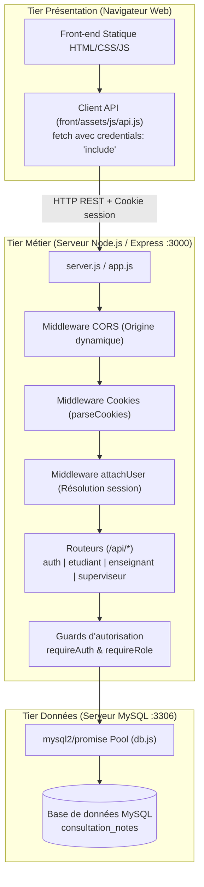
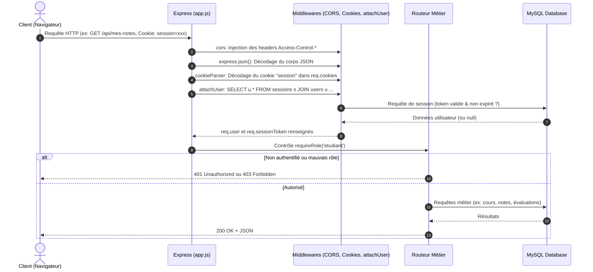
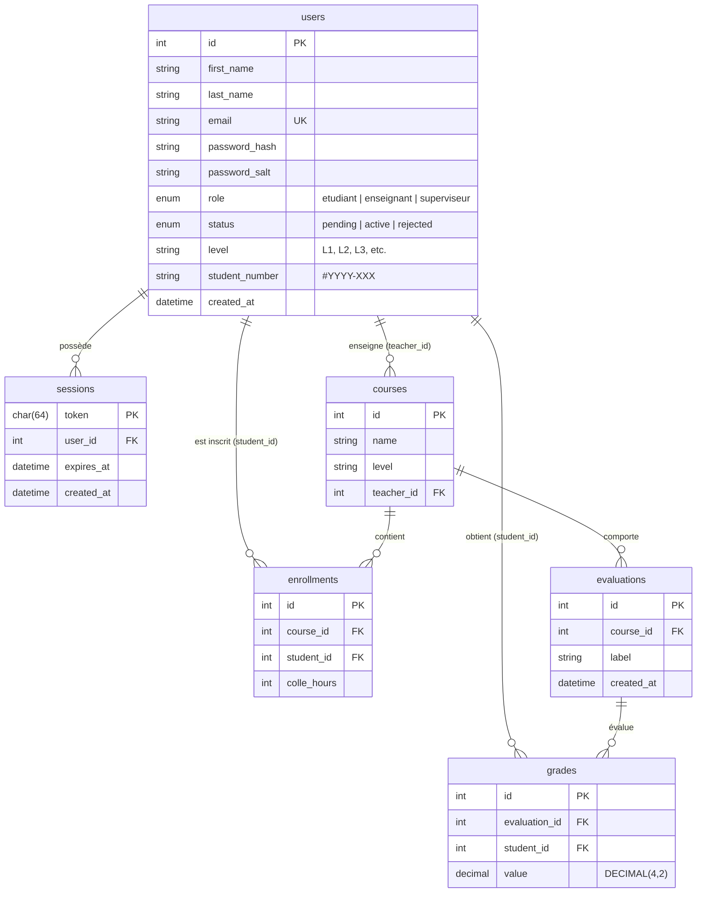

# Documentation Technique — Consultation Notes

> Document de référence à destination des développeurs et mainteneurs du projet **Consultation Notes**.  
> Ce document a pour objectif de permettre une reprise en main rapide, autonome et pérenne de la codebase.

---

## Sommaire

1. [Vue d'ensemble & Philosophie du projet](#1-vue-densemble--philosophie-du-projet)
2. [Architecture globale du système](#2-architecture-globale-du-système)
3. [Arborescence détaillée du projet](#3-arborescence-détaillée-du-projet)
4. [Prise en main & Environnement de développement](#4-prise-en-main--environnement-de-développement)
5. [Modèle de données & Base de données MySQL](#5-modèle-de-données--base-de-données-mysql)
6. [Mécanismes internes & Sécurité (Implémentations sans dépendance tierce)](#6-mécanismes-internes--sécurité-implémentations-sans-dépendance-tierce)
   - [6.1. Hachage et vérification des mots de passe (crypto natif)](#61-hachage-et-vérification-des-mots-de-passe-crypto-natif)
   - [6.2. Sessions persistantes en base & Cookies sécurisés](#62-sessions-persistantes-en-base--cookies-sécurisés)
   - [6.3. Gestion des cookies sans `cookie-parser`](#63-gestion-des-cookies-sans-cookie-parser)
   - [6.4. Gestion du `.env` sans `dotenv`](#64-gestion-du-env-sans-dotenv)
   - [6.5. CORS avec transmission de cookies (Credentials)](#65-cors-avec-transmission-de-cookies-credentials)
7. [Référentiel des API (Contrats d'interface)](#7-référentiel-des-api-contrats-dinterface)
   - [7.1. Authentification & Profil](#71-authentification--profil)
   - [7.2. Espace Étudiant](#72-espace-étudiant)
   - [7.3. Espace Enseignant](#73-espace-enseignant)
   - [7.4. Espace Superviseur](#74-espace-superviseur)
8. [Architecture Frontend (Vanilla JS)](#8-architecture-frontend-vanilla-js)
9. [Guide du développeur : Étendre et modifier l'application](#9-guide-du-développeur--étendre-et-modifier-lapplication)
   - [Ajouter un nouvel endpoint API](#ajouter-un-nouvel-endpoint-api)
   - [Ajouter une nouvelle table ou colonne SQL](#ajouter-une-nouvelle-table-ou-colonne-sql)
   - [Ajouter une nouvelle vue côté client](#ajouter-une-nouvelle-vue-côté-client)
10. [Dépannage fréquent (Troubleshooting)](#10-dépannage-fréquent-troubleshooting)
11. [Dette technique & Axes d'amélioration recommandés](#11-dette-technique--axes-damélioration-recommandés)

---

## 1. Vue d'ensemble & Philosophie du projet

**Consultation Notes** est une application web 3-tiers conçue pour la consultation et la gestion de notes scolaires (projet académique DEV1).

### Principes architecturaux clés
- **Zéro surcouche inutile (KISS & Vanilla First)** :
  - Côté Frontend : aucun framework (pas de React, Vue, Angular), pas d'outil de build lourd (pas de Vite/Webpack/Babel), CSS et JS natifs.
  - Côté Backend : Node.js et Express minimaliste, **sans modules externes lourds** pour les fonctions critiques (pas de `bcrypt`, pas de `jsonwebtoken`, pas de `passport`, pas de `cookie-parser`, pas de `dotenv`).
  - Toutes ces fonctionnalités sont assurées par l'API native `crypto` et les flux natifs Node.js.
- **Séparation stricte des responsabilités (3-tiers)** :
  - **Tier Présentation (Front)** : Pages HTML statiques, styles CSS, scripts JS communicant uniquement en JSON via HTTP(S).
  - **Tier Métier (API Node.js)** : Traitement logique, validation, contrôle d'accès basé sur les rôles, gestion des sessions.
  - **Tier Données (MySQL)** : Persistance relationnelle intègre avec clés étrangères et contraintes d'unicité.
  - *Le client n'a jamais d'accès direct à la base de données.*

### Rôles & Matrice des autorisations

| Rôle | Statut requis | Périmètre d'action |
|---|---|---|
| **Visiteur** | N/A | Consultation de la page de login, demande de création de compte (`POST /api/inscription`). |
| **Étudiant** | `status = 'active'` | Consultation de ses notes, moyennes par cours, moyenne générale, détection de devoirs à venir. |
| **Enseignant** | `status = 'active'` | Consultation de ses cours et des étudiants inscrits, création d'évaluations, saisie/modification des notes, attribution d'heures de colle. |
| **Superviseur** | `status = 'active'` | Visualisation des demandes d'inscriptions en attente (`pending`), validation (`active`) ou refus (`rejected`), tableau de bord statistique de l'école. |

> **Important** : À la création d'un compte étudiant ou enseignant, le compte est créé avec le statut `pending`. Tant qu'un compte n'a pas été validé par un superviseur, toute tentative de connexion est rejetée avec un code HTTP 403.

---

## 2. Architecture globale du système

### Diagramme de flux 3-tiers



### Pipeline de traitement d'une requête HTTP

Chaque requête entrante dans Express passe par le pipeline suivant :



---

## 3. Arborescence détaillée du projet

```
consultation-notes/
├── README.md                     # Documentation utilisateur synthétique
├── DOCUMENTATION_TECHNIQUE.md    # Présente documentation technique exhaustive
├── .gitignore                    # Exclusion de node_modules, .env, logs
│
├── api/                          # BACKEND (Node.js + Express)
│   ├── .env                      # Variables d'environnement locales (non commité)
│   ├── .env.example              # Gabarit des variables d'environnement
│   ├── package.json              # Dépendances (express, mysql2) & scripts
│   ├── package-lock.json         # Arbre figé des dépendances npm
│   ├── server.js                 # Point d'entrée HTTP (chargement env + listen)
│   │
│   ├── sql/                      # Scripts d'initialisation de la BDD
│   │   ├── schema.sql            # Définition DDL des tables, clés et contraintes
│   │   └── seed.sql              # Jeu de données de test et comptes de démonstration
│   │
│   └── src/                      # Code source de l'API
│       ├── app.js                # Configuration Express & montage des routes
│       ├── config/
│       │   ├── db.js             # Pool de connexions MySQL (mysql2/promise)
│       │   └── env.js            # Parseur .env maison (sans dépendance dotenv)
│       ├── middleware/
│       │   ├── auth.js           # attachUser, requireAuth, requireRole(role)
│       │   ├── cookies.js        # Parseur manuel du header 'Cookie'
│       │   └── cors.js           # Configuration CORS dynamique avec credentials
│       ├── routes/
│       │   ├── auth.routes.js        # /connexion, /inscription, /deconnexion, /moi
│       │   ├── enseignant.routes.js  # /mes-cours, /cours/:id/notes, évaluations, colles
│       │   ├── etudiant.routes.js    # /mes-notes (relevé de notes, moyennes)
│       │   └── superviseur.routes.js # /comptes-en-attente, validation, stats
│       └── utils/
│           ├── mappers.js        # toSafeUser (nettoyage hash/sel avant envoi)
│           ├── password.js       # Hachage et comparaison scrypt (crypto natif)
│           └── session.js        # CRUD sessions en BDD et génération de tokens
│
└── front/                        # FRONTEND (Statique Vanilla HTML/CSS/JS)
    ├── index.html                # Page de connexion principale
    ├── signup.html               # Formulaire de demande d'inscription
    ├── assets/
    │   ├── css/
    │   │   ├── auth.css          # Styles des vues d'authentification (login, signup)
    │   │   ├── dashboard.css     # Styles des tableaux de bord & badges
    │   │   └── styles.css        # Variables CSS, reset, typographie, composants
    │   └── js/
    │       ├── api.js            # Wrapper client fetch (gestion d'erreurs, credentials)
    │       ├── login.js          # Logique du formulaire de connexion
    │       ├── signup.js         # Logique du formulaire d'inscription
    │       ├── topbar.js         # Barre supérieure partagée & garde de navigation
    │       ├── etudiant.js       # Rendu du relevé de notes étudiant
    │       ├── enseignant.js     # Gestion des cours, saisie des notes et colles
    │       └── superviseur.js    # Gestion des validations et statistiques
    ├── etudiant/
    │   └── index.html            # Espace personnel étudiant
    ├── enseignant/
    │   └── index.html            # Espace gestion enseignant
    └── superviseur/
        └── index.html            # Espace supervision et administration
```

---

## 4. Prise en main & Environnement de développement

### 4.1. Prérequis techniques
- **Node.js** : version `>= 18.11.0` requise (l'utilisation de l'argument natif `--watch` dans `npm run dev` nécessite Node 18.11+ ; Node 20+ LTS recommandé).
- **MySQL Server** : version `8.0+` ou `MariaDB 10.5+`.
- **Navigateur moderne** : Chrome, Firefox, Safari ou Edge (support natif de ES6+ et `fetch`).

### 4.2. Configuration de la base de données

1. Démarrez votre service MySQL local (ex: via service Windows, Homebrew ou MySQL Workbench).
2. Exécutez le script de schéma, puis facultativement le jeu d'essai :

```bash
# 1. Création de la base et des tables
mysql -u root -p --default-character-set=utf8mb4 < api/sql/schema.sql

# 2. Insertion des données d'exemple (recommandé pour le dev)
mysql -u root -p --default-character-set=utf8mb4 < api/sql/seed.sql
```

> ⚠️ **Précision importante sur l'encodage** :  
> L'option `--default-character-set=utf8mb4` est indispensable. Sans cette option, les accents français (ex: "Léa", "Mathématiques") peuvent être corrompus par la console sous Windows/Linux.

### 4.3. Configuration et lancement du Backend

```bash
cd api

# Dupliquer le gabarit des variables d'environnement
cp .env.example .env

# Installer les dépendances (uniquement express et mysql2)
npm install

# Démarrer en mode développement (avec rechargement automatique natif)
npm run dev
```

Contenu type du fichier `api/.env` :
```env
PORT=3000
DB_HOST=localhost
DB_PORT=3306
DB_USER=root
DB_PASSWORD=secret
DB_NAME=consultation_notes
```

L'API est alors accessible sur : `http://localhost:3000`.

### 4.4. Lancement du Frontend

Le frontend est composé de fichiers purement statiques. Il ne nécessite aucun build.  
Toutefois, pour que les cookies de session transitent correctement avec `credentials: 'include'`, le front **doit** être servi par un serveur HTTP (et non ouvert via le protocole `file:///`).

Exemples de serveurs de développement légers :
```bash
# Option A : avec le package npm "serve"
npx serve front -l 5000

# Option B : avec Python 3
cd front && python -m http.server 5000

# Option C : avec l'extension VSCode "Live Server"
# Clic droit sur front/index.html -> "Open with Live Server"
```

Accédez à l'application via : `http://localhost:5000` (ou l'URL fournie par Live Server).

### 4.5. Comptes de test disponibles immédiatement

Tous les comptes créés par `seed.sql` partagent le même mot de passe : `password123`.

| Email | Mot de passe | Rôle | Statut | Usage principal |
|---|---|---|---|---|
| `lea.martin@ecole.fr` | `password123` | Étudiant | `active` | Test du relevé de notes, moyennes, calculs de rang. |
| `zianemenni@outlook.fr` | `password123` | Enseignant | `active` | Cours de Mathématiques (notes, saisie CC, colles). |
| `a.devogelaere@ecole.fr` | `password123` | Superviseur | `active` | Validation des demandes, statistiques globales. |
| `t.marchand@ecole.fr` | `password123` | Étudiant | `pending` | Demande en attente (visible dans l'écran superviseur). |

---

## 5. Modèle de données & Base de données MySQL

Le schéma est défini dans [`api/sql/schema.sql`](file:///c:/Users/Utilisateur/consultation-notes/api/sql/schema.sql).

### Diagramme Entité-Association (ERD)



### Détail des tables et contraintes

1. **`users`** :
   - Clé primaire : `id` (`INT AUTO_INCREMENT`).
   - Unicité : `email` (`VARCHAR(190) UNIQUE`).
   - Rôles (`role`) : `'etudiant'`, `'enseignant'`, `'superviseur'`.
   - Statuts (`status`) : `'pending'`, `'active'`, `'rejected'`.
   - Numéro d'étudiant (`student_number`) : format généré `#YYYY-ID` (ex: `#2024-001`).

2. **`sessions`** :
   - Clé primaire : `token` (`CHAR(64)` en hexadécimal).
   - Clé étrangère : `user_id` vers `users(id)` avec `ON DELETE CASCADE`.
   - Durée : `expires_at` (7 jours par défaut).

3. **`courses`** :
   - Clé étrangère : `teacher_id` vers `users(id)` avec `ON DELETE CASCADE`.

4. **`enrollments`** :
   - Table de liaison Many-to-Many entre étudiants et cours.
   - Contrainte d'unicité : `UNIQUE KEY uniq_course_student (course_id, student_id)`.
   - Colonne métier : `colle_hours` (`INT NOT NULL DEFAULT 0`).

5. **`evaluations`** :
   - Représente un devoir/contrôle (`Devoir 1`, `Contrôle continu`, etc.).
   - Clé étrangère : `course_id` vers `courses(id)` avec `ON DELETE CASCADE`.

6. **`grades`** :
   - Clé étrangère : `evaluation_id` et `student_id` avec `ON DELETE CASCADE`.
   - Contrainte d'unicité : `UNIQUE KEY uniq_eval_student (evaluation_id, student_id)` (un étudiant ne peut avoir qu'une seule note par évaluation).
   - Valeur : `DECIMAL(4, 2)` (valeur entre 0.00 et 20.00).

---

## 6. Mécanismes internes & Sécurité (Implémentations sans dépendance tierce)

Le projet se distingue par sa volonté de limiter les dépendances externes à leur strict minimum. Voici le fonctionnement technique détaillé des modules clés.

### 6.1. Hachage et vérification des mots de passe (crypto natif)
Fichier source : [`api/src/utils/password.js`](file:///c:/Users/Utilisateur/consultation-notes/api/src/utils/password.js)

Au lieu d'utiliser `bcrypt` ou `argon2`, le projet s'appuie sur la fonction de dérivation de clé `scrypt` intégrée au runtime Node.js :
- **Génération du sel** : 16 octets aléatoires cryptographiques via `crypto.randomBytes(16).toString('hex')`.
- **Calcul du hash** : `crypto.scryptSync(password, salt, 64).toString('hex')`.
- **Vérification en temps constant** :
  ```javascript
  const candidate = crypto.scryptSync(password, salt, KEY_LENGTH);
  const stored = Buffer.from(hash, 'hex');
  if (candidate.length !== stored.length) return false;
  return crypto.timingSafeEqual(candidate, stored);
  ```
  L'utilisation de `crypto.timingSafeEqual` empêche formellement les attaques par canal auxiliaire de type analyse temporelle (*timing attacks*).

### 6.2. Sessions persistantes en base & Cookies sécurisés
Fichier source : [`api/src/utils/session.js`](file:///c:/Users/Utilisateur/consultation-notes/api/src/utils/session.js)

- **Génération du token** : 32 octets aléatoires (`crypto.randomBytes(32).toString('hex')`), produisant une chaîne hexadécimale de 64 caractères imprévisible et infalsifiable.
- **Stockage** : Inséré dans la table MySQL `sessions` avec un horodatage d'expiration calculé à `Date.now() + 7 jours`.
- **Attribution au client** : Déposé dans un cookie HTTP :
  ```javascript
  res.cookie(COOKIE_NAME, token, {
    httpOnly: true,       // Inaccessible depuis JavaScript (protection XSS)
    sameSite: 'lax',      // Protection CSRF standard
    maxAge: SESSION_DURATION_MS,
  });
  ```
- **Validation** : Le middleware `attachUser` effectue une jointure SQL avec la condition `s.expires_at > NOW()`.

### 6.3. Gestion des cookies sans `cookie-parser`
Fichier source : [`api/src/middleware/cookies.js`](file:///c:/Users/Utilisateur/consultation-notes/api/src/middleware/cookies.js)

Le middleware extrait directement l'en-tête `Cookie` de la requête HTTP, le découpe par point-virgule, puis alimente l'objet `req.cookies` de manière transparente pour les routes suivantes.

### 6.4. Gestion du `.env` sans `dotenv`
Fichier source : [`api/src/config/env.js`](file:///c:/Users/Utilisateur/consultation-notes/api/src/config/env.js)

La fonction `loadEnv()` lit le fichier `.env` à la racine de `api/`, ignore les commentaires `#` et les lignes vides, et peuple `process.env` pour toute clé non encore présente dans l'environnement d'exécution.

### 6.5. CORS avec transmission de cookies (Credentials)
Fichier source : [`api/src/middleware/cors.js`](file:///c:/Users/Utilisateur/consultation-notes/api/src/middleware/cors.js)

Le front et l'API étant souvent servis sur des ports distincts (ex: `localhost:5000` et `localhost:3000`), le navigateur refuse la transmission de cookies de session sans en-têtes CORS précis :
- `Access-Control-Allow-Origin` : renvoie dynamiquement la valeur de l'en-tête `Origin` de la requête cliente (car le joker `*` est interdit par le standard W3C dès lors que `Allow-Credentials` vaut `true`).
- `Access-Control-Allow-Credentials: true` : autorise le transport des cookies.
- `Vary: Origin` : prévient l'empoisonnement de cache mandataire (proxy/CDN).
- Gestion native de la pré-requête `OPTIONS` (réponse immédiate HTTP 204).

---

## 7. Référentiel des API (Contrats d'interface)

Toutes les routes sont préfixées par `/api`. Les corps de requête et de réponse sont au format `application/json`.

### Codes de statut HTTP standards utilisés
- `200 OK` : Succès de lecture ou mise à jour.
- `201 Created` : Ressource créée avec succès (inscription, évaluation).
- `400 Bad Request` : Paramètres manquants ou invalides (ex: note hors de `[0, 20]`).
- `401 Unauthorized` : Aucun utilisateur authentifié ou token de session expiré.
- `403 Forbidden` : Compte non validé (`pending`), refusé (`rejected`) ou rôle insuffisant.
- `404 Not Found` : Ressource non trouvée (cours introuvable ou non possédé par l'enseignant).
- `409 Conflict` : Conflit de données (ex: email déjà utilisé).
- `500 Internal Server Error` : Erreur inattendue côté serveur.

---

### 7.1. Authentification & Profil
Fichier : [`api/src/routes/auth.routes.js`](file:///c:/Users/Utilisateur/consultation-notes/api/src/routes/auth.routes.js)

#### `POST /api/connexion`
- **Accès** : Public
- **Corps de la requête** :
  ```json
  {
    "email": "lea.martin@ecole.fr",
    "password": "password123"
  }
  ```
- **Réponse 200** : Positionne le cookie `session` et renvoie l'objet utilisateur sécurisé :
  ```json
  {
    "id": 5,
    "firstName": "Léa",
    "lastName": "Martin",
    "email": "lea.martin@ecole.fr",
    "role": "etudiant",
    "level": "L3",
    "studentNumber": "#2024-001"
  }
  ```

#### `POST /api/inscription`
- **Accès** : Public
- **Corps de la requête** :
  ```json
  {
    "firstName": "Jean",
    "lastName": "Dupont",
    "email": "j.dupont@ecole.fr",
    "password": "motdepasse123",
    "role": "etudiant",
    "level": "L3"
  }
  ```
- **Règles métier** :
  - `role` doit valoir `'etudiant'` ou `'enseignant'`.
  - Le mot de passe doit faire au moins 8 caractères.
  - Le statut initial est fixé à `'pending'`.
  - Si le rôle est `'etudiant'`, un `student_number` au format `#YYYY-ID` est automatiquement attribué.
- **Réponse 201** :
  ```json
  { "message": "Demande de compte envoyée." }
  ```

#### `POST /api/deconnexion`
- **Accès** : Authentifié
- **Effet** : Supprime la session en base de données et efface le cookie du navigateur.
- **Réponse 200** :
  ```json
  { "message": "Déconnecté." }
  ```

#### `GET /api/moi`
- **Accès** : Authentifié
- **Réponse 200** : Objet utilisateur de la session courante (renvoie 401 si non connecté).

---

### 7.2. Espace Étudiant
Fichier : [`api/src/routes/etudiant.routes.js`](file:///c:/Users/Utilisateur/consultation-notes/api/src/routes/etudiant.routes.js)

#### `GET /api/mes-notes`
- **Accès** : Rôle `etudiant` requis
- **Description** : Renvoie l'intégralité du relevé de notes, les cours suivis, les moyennes par matière et la moyenne globale.
- **Réponse 200** :
  ```json
  {
    "average": 14.5,
    "averageDelta": null,
    "coursesCount": 4,
    "coursesWithUpcoming": 1,
    "best": {
      "average": 17.83,
      "courseName": "Informatique"
    },
    "courses": [
      {
        "id": 1,
        "name": "Mathématiques",
        "teacherName": "Pr. Menni",
        "grades": [12, 15],
        "average": 13.5,
        "hasUpcoming": true
      }
    ]
  }
  ```

---

### 7.3. Espace Enseignant
Fichier : [`api/src/routes/enseignant.routes.js`](file:///c:/Users/Utilisateur/consultation-notes/api/src/routes/enseignant.routes.js)

#### `GET /api/mes-cours`
- **Accès** : Rôle `enseignant` requis
- **Description** : Liste les cours dont l'enseignant connecté est le propriétaire (`teacher_id = req.user.id`).
- **Réponse 200** :
  ```json
  [
    {
      "id": 1,
      "name": "Mathématiques",
      "level": "L3",
      "studentsCount": 6
    }
  ]
  ```

#### `GET /api/cours/:id/notes`
- **Accès** : Enseignant propriétaire du cours `:id`
- **Description** : Retourne les étudiants inscrits au cours, leur moyenne globale dans le cours, leur note à la dernière évaluation créée et leurs heures de colle.
- **Réponse 200** :
  ```json
  {
    "id": 1,
    "name": "Mathématiques",
    "level": "L3",
    "currentEvaluation": { "id": 5, "label": "Contrôle continu" },
    "students": [
      {
        "id": 5,
        "firstName": "Léa",
        "lastName": "Martin",
        "level": "L3",
        "studentNumber": "#2024-001",
        "colleHours": 0,
        "average": 13.5,
        "currentGrade": 14.0
      }
    ]
  }
  ```

#### `POST /api/cours/:id/evaluations`
- **Accès** : Enseignant propriétaire du cours `:id`
- **Corps de la requête** : `{ "label": "Devoir sur table 3" }`
- **Réponse 201** : `{ "id": 8, "label": "Devoir sur table 3" }`

#### `PUT /api/cours/:id/etudiants/:studentId/note`
- **Accès** : Enseignant propriétaire du cours `:id`
- **Corps de la requête** : `{ "evaluationId": 5, "value": 14.5 }`  
  *(Envoyer `value: ""` ou `null` supprime la note en base).*
- **Règles** : La valeur doit être un nombre compris entre 0 et 20.

#### `PUT /api/cours/:id/etudiants/:studentId/colle`
- **Accès** : Enseignant propriétaire du cours `:id`
- **Corps de la requête** : `{ "hours": 2 }`
- **Règles** : `hours` doit être un entier positif ou nul.

---

### 7.4. Espace Superviseur
Fichier : [`api/src/routes/superviseur.routes.js`](file:///c:/Users/Utilisateur/consultation-notes/api/src/routes/superviseur.routes.js)

#### `GET /api/comptes-en-attente`
- **Accès** : Rôle `superviseur` requis
- **Description** : Liste les comptes avec `status = 'pending'`.

#### `POST /api/comptes-en-attente/:id/valider`
- **Accès** : Rôle `superviseur` requis
- **Effet** : Passe le statut de l'utilisateur à `'active'`.

#### `POST /api/comptes-en-attente/:id/refuser`
- **Accès** : Rôle `superviseur` requis
- **Effet** : Passe le statut de l'utilisateur à `'rejected'`.

#### `GET /api/admin/stats`
- **Accès** : Rôle `superviseur` requis
- **Réponse 200** :
  ```json
  {
    "pending": 3,
    "students": 6,
    "teachers": 4,
    "activeCourses": 4
  }
  ```

---

## 8. Architecture Frontend (Vanilla JS)

### Organisation des modules JS
1. **`api.js` (Couche réseau)** :
   - Configure `API_BASE = 'http://localhost:3000/api'`.
   - Fournit `api.get(url)`, `api.post(url, body)`, `api.put(url, body)`.
   - Active systématiquement `credentials: 'include'` pour garantir l'envoi du cookie de session.
   - Propage les erreurs métier via la classe typée `ApiError(status, data)`.

2. **`topbar.js` (Contrôle d'accès côté client)** :
   - Fournit la fonction `requireRole(expectedRole)`.
   - À l'ouverture d'une page protégée (ex: `/etudiant/index.html`), appelle `GET /api/moi` :
     - Si l'utilisateur n'est pas authentifié -> redirection automatique vers `/index.html`.
     - Si l'utilisateur a un rôle différent -> redirection automatique vers son espace dédié (ex: `/${user.role}/index.html`).
     - Si le rôle concorde -> injection de la barre supérieure (nom, initiales, bouton déconnexion).

3. **Modules de vues (`etudiant.js`, `enseignant.js`, `superviseur.js`)** :
   - Récupèrent les données via `api.js`.
   - Génèrent les structures DOM via des templates HTML ou des sélecteurs natifs (`document.querySelector`).
   - Gèrent les états de chargement, d'erreur et les interactions asynchrones (soumission sans rechargement de page).

---

## 9. Guide du développeur : Étendre et modifier l'application

### Ajouter un nouvel endpoint API

1. **Identifier le périmètre et le fichier de route** :
   - Auth générale -> [`api/src/routes/auth.routes.js`](file:///c:/Users/Utilisateur/consultation-notes/api/src/routes/auth.routes.js)
   - Espace étudiant -> [`api/src/routes/etudiant.routes.js`](file:///c:/Users/Utilisateur/consultation-notes/api/src/routes/etudiant.routes.js)
   - Espace enseignant -> [`api/src/routes/enseignant.routes.js`](file:///c:/Users/Utilisateur/consultation-notes/api/src/routes/enseignant.routes.js)
   - Espace superviseur -> [`api/src/routes/superviseur.routes.js`](file:///c:/Users/Utilisateur/consultation-notes/api/src/routes/superviseur.routes.js)
2. **Appliquer le contrôle d'accès adéquat** :
   ```javascript
   const { requireAuth, requireRole } = require('../middleware/auth');
   router.get('/nouvelle-route', requireRole('etudiant'), async (req, res, next) => { ... });
   ```
3. **Utiliser systématiquement les requêtes SQL préparées** :
   ```javascript
   // ✅ BON : protégé contre les injections SQL
   const [rows] = await pool.query('SELECT * FROM table WHERE user_id = ?', [req.user.id]);

   // ❌ INTERDIT : vulnérable aux injections SQL
   const [rows] = await pool.query(`SELECT * FROM table WHERE user_id = ${req.user.id}`);
   ```
4. **Encapsuler dans un bloc `try / catch`** en passant les erreurs non gérées à `next(err)` pour le middleware d'erreur centralisé.

### Ajouter une nouvelle table ou colonne SQL

1. Modifier le schéma initial dans [`api/sql/schema.sql`](file:///c:/Users/Utilisateur/consultation-notes/api/sql/schema.sql).
2. Si vous ajoutez des colonnes pour le profil utilisateur, veillez à adapter [`api/src/utils/mappers.js`](file:///c:/Users/Utilisateur/consultation-notes/api/src/utils/mappers.js) afin de contrôler précisément les champs exposés au client.
3. Pour la base locale existante, appliquez un `ALTER TABLE` équivalent directement dans MySQL :
   ```sql
   ALTER TABLE users ADD COLUMN phone VARCHAR(20) NULL;
   ```

### Ajouter une nouvelle vue côté client

1. Créer le dossier et le fichier HTML (ex: `front/mon-espace/index.html`).
2. Lier les styles de base et les scripts :
   ```html
   <link rel="stylesheet" href="../assets/css/styles.css" />
   <link rel="stylesheet" href="../assets/css/dashboard.css" />
   ...
   <div id="topbar"></div>
   ...
   <script src="../assets/js/api.js"></script>
   <script src="../assets/js/topbar.js"></script>
   <script src="../assets/js/mon-espace.js"></script>
   ```
3. Au début du script `mon-espace.js`, initialiser la sécurité de page :
   ```javascript
   document.addEventListener('DOMContentLoaded', async () => {
     const user = await requireRole('mon-role');
     if (!user) return; // redirection déjà gérée par requireRole
     // Initialisation des données de la page
   });
   ```

---

## 10. Dépannage fréquent (Troubleshooting)

### Problème 1 : Les noms de cours ou prénoms ont des caractères bizarres ("Léa" au lieu de "Léa")
- **Cause** : Le client MySQL utilisé pour charger `schema.sql` ou `seed.sql` s'est connecté avec l'encodage `latin1` par défaut.
- **Solution** : Recréez la base en forçant l'encodage utf8mb4 :
  ```bash
  mysql -u root -p --default-character-set=utf8mb4 < api/sql/schema.sql
  mysql -u root -p --default-character-set=utf8mb4 < api/sql/seed.sql
  ```

### Problème 2 : Déconnexion immédiate / 401 sur toutes les requêtes après connexion
- **Cause A** : Le frontend est ouvert via un double clic sur le fichier (`file:///...`), empêchant les navigateurs de stocker ou d'envoyer des cookies.
  - **Solution** : Utilisez un serveur HTTP local (`npx serve front`, Live Server ou python).
- **Cause B** : L'URL de l'API dans `front/assets/js/api.js` ne correspond pas au port sur lequel écoute Express.
  - **Solution** : Vérifiez que `API_BASE` pointe bien sur `http://localhost:3000/api`.

### Problème 3 : Erreur `ECONNREFUSED` lors du lancement de l'API
- **Cause** : Le serveur MySQL n'est pas démarré ou n'écoute pas sur le port configuré.
- **Solution** : Démarrez votre service MySQL et vérifiez les identifiants dans `api/.env`.

---

## 11. Dette technique & Axes d'amélioration recommandés

Pour un développeur reprenant le projet sur le long terme, voici les chantiers recommandés :

1. **Purge automatique des sessions expirées** :
   - *État actuel* : Les sessions expirées sont ignorées par `expires_at > NOW()`, mais restent stockées en base.
   - *Amélioration* : Mettre en place un `cron` (ou un `setInterval` applicatif, ou un `EVENT` MySQL planifié) pour exécuter périodiquement `DELETE FROM sessions WHERE expires_at < NOW()`.
2. **Hachage asynchrone pour la charge** :
   - *État actuel* : `crypto.scryptSync` est synchrone et bloque la boucle d'événements pendant quelques millisecondes par tentative de login.
   - *Amélioration* : Migrer vers la version asynchrone `crypto.scrypt(..., callback)` encapsulée dans une Promise pour absorber de fortes charges concurrentes.
3. **Paramétrage de l'URL d'API en frontend** :
   - *État actuel* : `API_BASE` est figé en dur dans `front/assets/js/api.js` (`http://localhost:3000/api`).
   - *Amélioration* : Détecter dynamiquement l'hôte ou injecter une configuration d'environnement pour simplifier le déploiement en production (HTTPS / domaine dédié).
4. **Suite de tests automatisés** :
   - *Amélioration* : Mettre en place des tests d'intégration avec le test runner natif de Node.js (`node:test` et `node:assert`, disponibles sans installer Jest ou Mocha) pour valider automatiquement les routes d'authentification et les contrôles de rôles.
